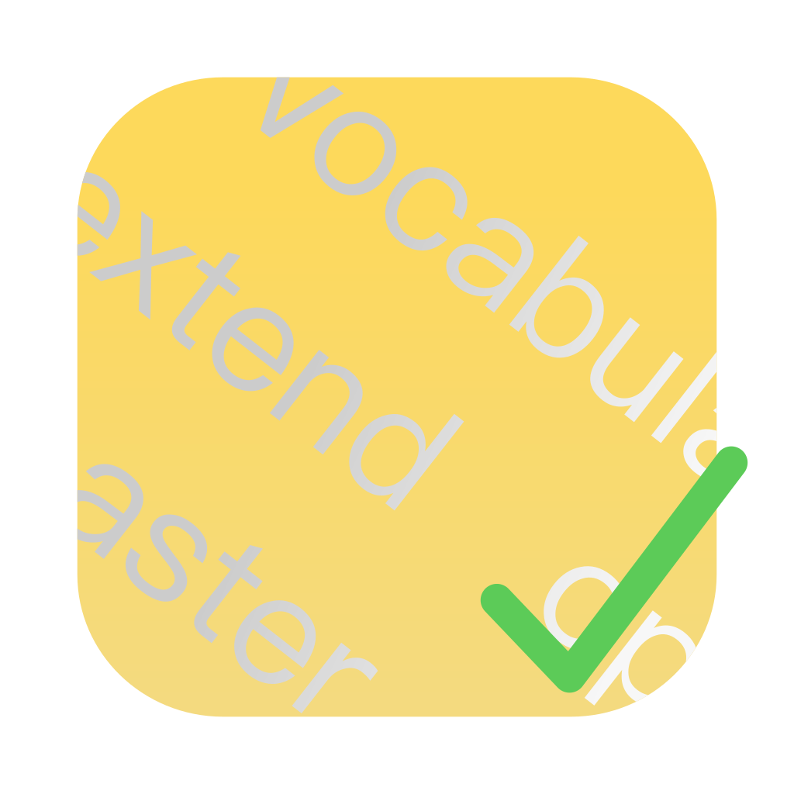

# Vocab Master
## 词达人辅助工具



或许有点用

### Tip
使用```-proxy=false```参数可以使程序在打开时不对系统代理进行操作

程序内提供词达人处理器开关，可打开/关闭词达人注入。

### 原理
使用MITM Proxy监听&注入词达人网页，实现辅助功能。

### 注意事项
1. 本项目旨在为了让词汇已经过关的人，不再被这个东西所困扰。
2. 打开程序会自动覆盖系统代理
3. **维护者目前只接触到CET4的一些课堂任务，只见过部分题型，（题型一样TopicMode也可能不同），后续遇到相关题型我会继续更新。**

### 如何使用？
1. 下载release中的压缩包并且解压
2. 运行vocab-master，他会在对应平台的应用数据存储区中生成cert文件夹，只需要将其中的.cer文件添加到系统的信任根证书中。这个文件夹可以用程序中的一个按钮打开。
3. 
4. 打开一个课堂任务，```重新选词```,and feel great ;)

### 我要编译
这是个go module，go ahead!

#### 关于项目的开发
自学任务由于需要再次分析，暂时搁置。

### 鸣谢
- [fyne.io](https://fyne.io)
- [github.com/Trisia/gosysproxy](https://github.com/Trisia/gosysproxy)
- [github.com/andybalholm/brotli](https://github.com/andybalholm/brotli)
- [github.com/lqqyt2423/go-mitmproxy](https://github.com/lqqyt2423/go-mitmproxy)